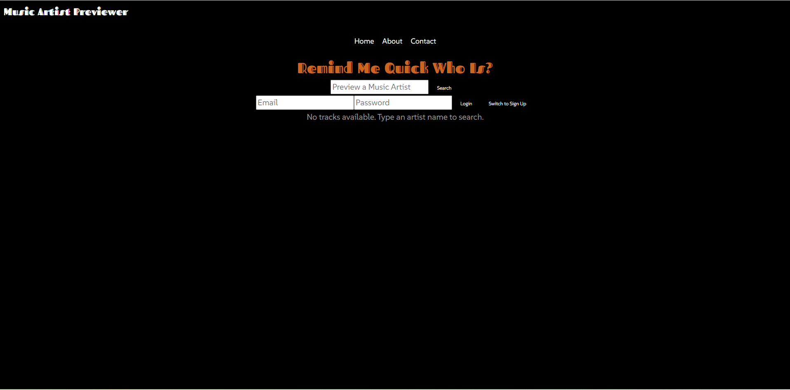
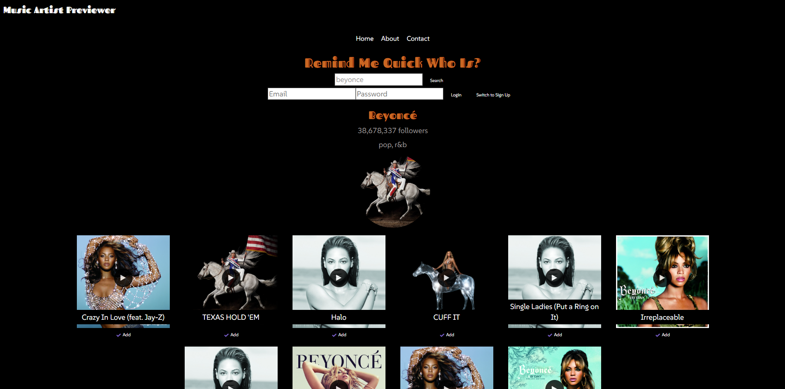
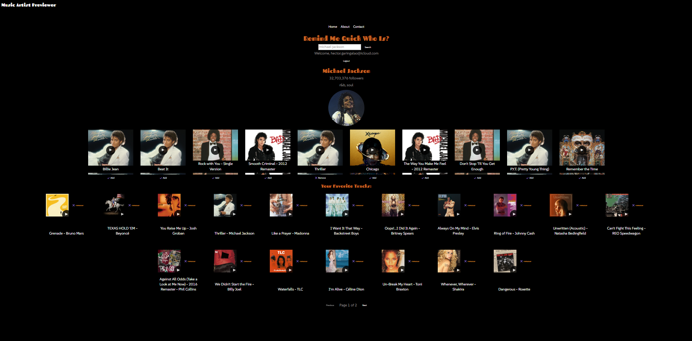
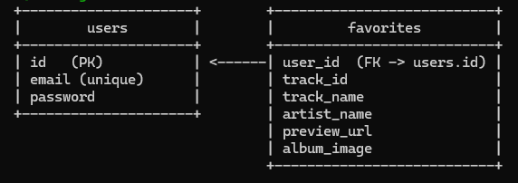

# Music Artist Previewer - Remind Me Quick Who Is?

## Overview

"Music Artist Previewer - Remind Me Quick Who Is?" is a web application built with React that allows users to search for music artists, preview their top tracks, and manage a personalized list of favorite tracks. It integrates with the Spotify API for fetching artist and track data, and utilizes Node.js with PostgreSQL for user authentication and storing user favorites.







## Database Schema

The database consists of two tables: `users` and `favorites`. Here's a diagram of the schema:

* **users** table: Stores user information such as `id`, `email`, and `password`.
* **favorites** table: Stores favorite tracks for each user, including fields like `user_id`, `track_id`, `track_name`, `artist_name`, `preview_url`, and `album_image`. It references the `users` table with a foreign key on `user_id`.

  

## Table of Contents

- [Features](#features)
- [Installation](#installation)
- [Configuration](#configuration)
- [Database Setup](#database-setup)
- [Running the Application](#running-the-application)
- [Project Structure](#project-structure)
- [Files Description](#files-description)
- [Key Functionality](#key-functionality)
- [Usage](#usage)
- [Technologies Used](#technologies-used)
- [Conclusion](#conclusion)

## Features

- Search for artists and preview their top tracks via the Spotify API
- User authentication (login/signup) using Node.js and JWT
- Manage a personal list of favorite tracks
- Pagination for viewing large collections of favorites
- Audio preview of tracks
- Responsive and user-friendly interface
- Notifications for actions like adding/removing tracks

## Installation

1. Clone the repository:
   ```bash
   git clone https://github.com/your-username/music-artist-previewer.git
   cd music-artist-previewer
   ```
2. Install the required dependencies:
   ```bash
   npm install
   ```

## Configuration

1. Set up PostgreSQL and create a database. You can use Render's PostgreSQL service, or any other PostgreSQL database provider.
2. Create a `.env` file in the root of the project and configure the following environment variables:

   ```bash
   PORT=5000
   DATABASE_URL=your_postgres_database_url
   PGSSLMODE=require
   JWT_SECRET=your_jwt_secret
   ```
3. Add your Spotify API wrapper address:
   Update the `API_ADDRESS` variable in `App.js` with your Spotify API wrapper URL (e.g., `https://spotify-api-wrapper.appspot.com`).

## Database Setup

1. Use the provided `seed.sql` file to set up the initial database schema. It will create `users` and `favorites` tables.
2. To apply the schema to your PostgreSQL database, run:

   ```bash
   psql -h hostname -d database_name -U username -f seed.sql
   ```
3. The `users` table stores user details, and the `favorites` table stores the user's favorite tracks.

## Running the Application

### Backend:

To run the backend server locally:

```bash
node app.js
```

The backend will be available at `http://localhost:5000`.

### Frontend:

To run the React app locally:

```bash
npm start
```

The app will be available at `http://localhost:3000`.

To build for production:

```bash
npm run build
```

## Project Structure

```
music-artist-previewer/
│
├── frontend/
│   ├── public/
│   │   └── index.html
│   ├── src/
│   │   ├── components/
│   │   │   ├── App.js
│   │   │   ├── Artist.js
│   │   │   ├── About.js
│   │   │   ├── Contact.js
│   │   │   ├── Search.js
│   │   │   ├── Tracks.js
│   │   ├── index.js
│   │   ├── index.css
│   │   ├── assets/
│   │   │   ├── email_icon.png
│   │   │   ├── github_icon.png
│   │   │   ├── linkedin_icon.png
│   │   │   ├── twitter_icon.png
│   │   └── data/
│   │       └── socialProfiles.js
│   ├── package.json
│
├── backend/
│   ├── app.js
│   ├── controllers/
│   │   ├── authController.js
│   │   ├── favoriteController.js
│   ├── middleware/
│   │   ├── authMiddleware.js
│   ├── routes/
│   │   ├── authRoutes.js
│   │   ├── favoriteRoutes.js
│   ├── db.js
│   ├── seed.sql
│   ├── .env
│   ├── package.json
│
├── .gitignore
├── README.md

```

## Files Description

- **App.js**: Main component handling routing, user authentication, artist and track searches, and favorites.
- **Artist.js**: Displays artist details (name, image, genres, followers).
- **Search.js**: Search bar for inputting and querying music artists.
- **Tracks.js**: Displays track details, audio preview, and allows users to add tracks to favorites.
- **Backend (Node.js)**: Manages authentication and favorite track storage using PostgreSQL.
  - **app.js**: Main file for setting up Express server and routes.
  - **authController.js**: Handles user signup and login with JWT.
  - **favoriteController.js**: Handles CRUD operations for user's favorite tracks.
  - **db.js**: PostgreSQL connection setup.

## Key Functionality

- **Search for Artists**: Users can search for music artists by name. The app fetches artist details and top tracks using the Spotify API.
- **Preview Tracks**: Users can preview available tracks directly within the app.
- **Add/Remove Favorites**: Logged-in users can add or remove tracks from their favorites list.
- **User Authentication**: Users can log in, sign up, or log out via JWT authentication managed by Node.js and PostgreSQL.
- **Pagination**: Favorites are paginated to ensure smooth browsing.

## Usage

1. Start the app and search for an artist.
2. Preview tracks from the artist's top tracks.
3. Log in or sign up to save your favorite tracks.
4. View and manage your favorite tracks in the favorites section with pagination.

## Technologies Used

- **React**: Front-end framework for building the UI.
- **Node.js**: Backend framework handling API requests, authentication, and database operations.
- **PostgreSQL**: Database used for storing user and favorite track information.
- **Spotify API**: Provides artist and track information.
- **JWT**: For authentication management on the backend.
- **Express**: For building backend REST API.
- **React Router**: For managing navigation within the app.

## Conclusion

"Music Artist Previewer - Remind Me Quick Who Is?" is a feature-rich web application that allows music lovers to explore artists, listen to their top tracks, and manage favorites. With Node.js and PostgreSQL handling authentication and data storage, users can seamlessly interact with the app and manage their preferences across devices. The app’s intuitive design ensures a smooth user experience for both casual listeners and music enthusiasts.
