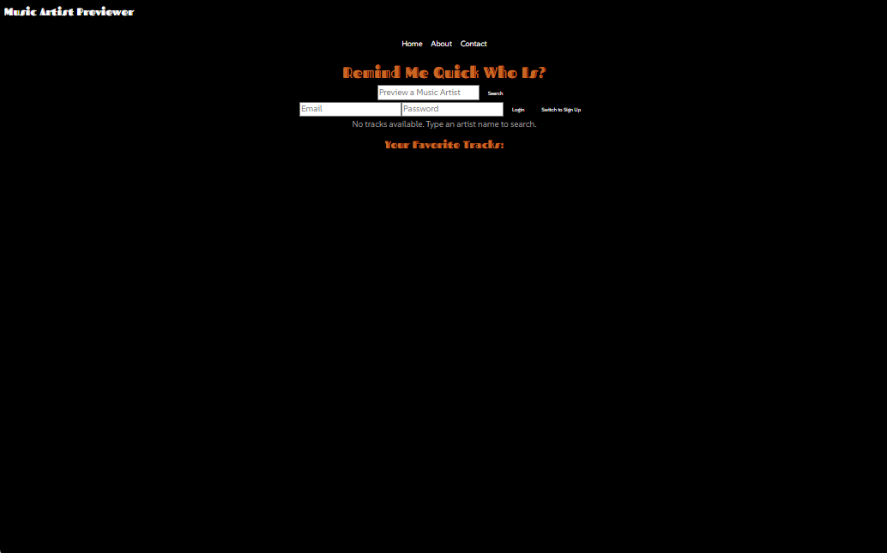
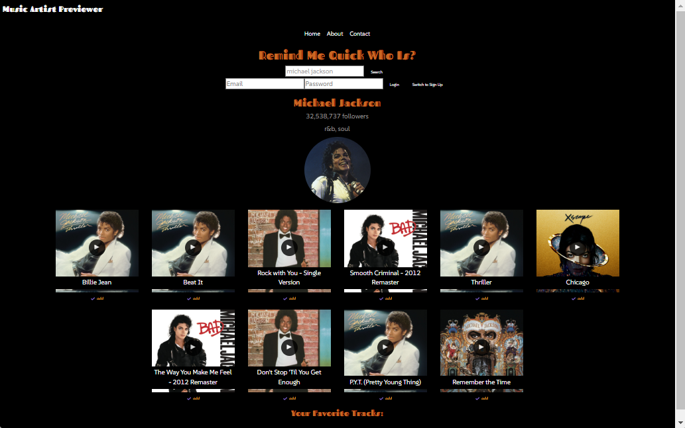
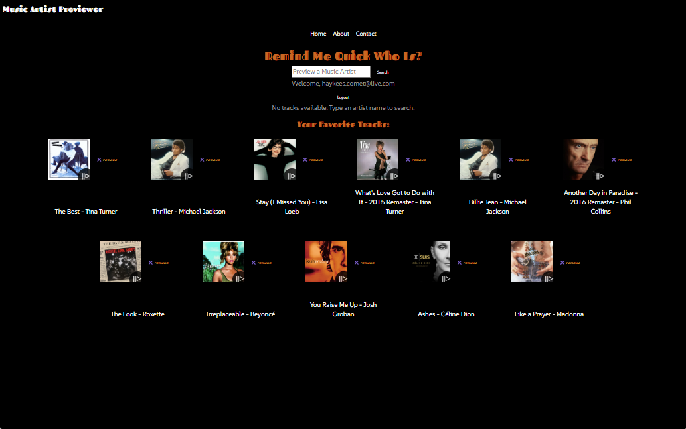
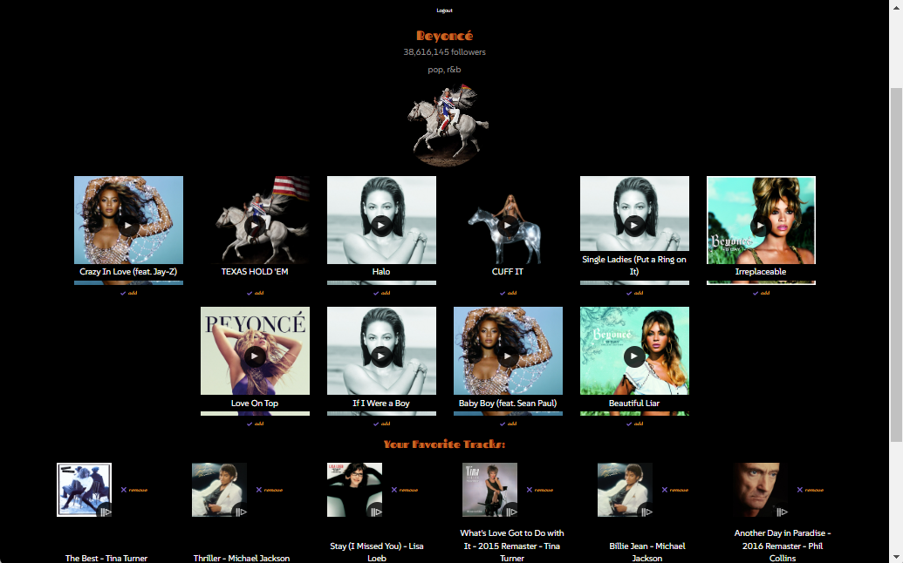

# Music Artist Previewer - Remind Me Quick Who Is?

## Overview

"Music Artist Previewer - Remind Me Quick Who Is?" is a web application built with React that allows users to search for music artists, preview their top tracks, and manage a personalized list of favorite tracks. It integrates with the Spotify API for fetching artist and track data, and Firebase for user authentication and storing user favorites.

Site deployed: [https://music-artist-previewer-267bd.web.app/](https://music-artist-previewer-267bd.web.app/)









## Table of Contents

- [Features](#features)
- [Installation](#installation)
- [Configuration](#configuration)
- [Database Setup](#database-setup)
- [Running the Application](#running-the-application)
- [Project Structure](#project-structure)
- [Files Description](#files-description)
- [Key Functionality](#key-functionality)
- [Usage](#usage)
- [Technologies Used](#technologies-used)
- [Conclusion](#conclusion)

## Features

- Search for artists and preview their top tracks via the Spotify API
- User authentication (login/signup) using Firebase
- Manage a personal list of favorite tracks
- Pagination for viewing large collections of favorites
- Audio preview of tracks
- Responsive and user-friendly interface
- Notifications for actions like adding/removing tracks

## Installation

1. Clone the repository:
   ```bash
   git clone https://github.com/your-username/music-artist-previewer.git
   cd music-artist-previewer
   ```
2. Install the required dependencies:
   ```bash
   npm install
   ```

## Configuration

1. Set up Firebase for authentication and Firestore database:

   - Go to the [Firebase Console](https://console.firebase.google.com/), create a new project, and add your web app's credentials to the `firebase.js` file.
   - Ensure Firebase Authentication (Email/Password) and Firestore Database are enabled.
2. Add your Spotify API wrapper address:
   Update the `API_ADDRESS` variable in `App.js` with your Spotify API wrapper URL (e.g., `https://spotify-api-wrapper.appspot.com`).

## Database Setup

Firebase Firestore is used for storing user favorite tracks. After configuring Firebase as described above, no additional setup is needed for Firestore. The app will handle creating collections and documents for each user's favorites.

## Running the Application

To run the app locally:

```bash
npm start
```

The app will be available at `http://localhost:3000`.

To build for production:

```bash
npm run build
```

## Project Structure

```
music-artist-previewer/
│
├── public/
│   └── index.html
│
├── src/
│   ├── App.js
│   ├── Artist.js
│   ├── About.js
│   ├── Contact.js
│   ├── Search.js
│   ├── Tracks.js
│   ├── firebase.js
│   ├── index.js
│   ├── index.css
│   ├── assets/
│   │   ├── email_icon.png
│   │   ├── github_icon.png
│   │   ├── linkedin_icon.png
│   │   ├── twitter_icon.png
│   └── data/
│       └── socialProfiles.js
│
├── .gitignore
├── firebase.json
```

## Files Description

- **App.js**: Main component handling routing, user authentication, artist and track searches, and favorites.
- **Artist.js**: Displays artist details (name, image, genres, followers).
- **Search.js**: Search bar for inputting and querying music artists.
- **Tracks.js**: Displays track details, audio preview, and allows users to add tracks to favorites.
- **About.js**: Page containing information about the app creator.
- **Contact.js**: Contact page for reaching out to the creator.
- **firebase.js**: Firebase configuration for authentication and database access.
- **index.css**: CSS file for the app's styling.

## Key Functionality

- **Search for Artists**: Users can search for music artists by name. The app fetches artist details and top tracks using the Spotify API.
- **Preview Tracks**: Users can preview available tracks directly within the app.
- **Add/Remove Favorites**: Logged-in users can add or remove tracks from their favorites list.
- **User Authentication**: Users can log in, sign up, or log out via Firebase Authentication.
- **Pagination**: Favorites are paginated to ensure smooth browsing.

## Usage

1. Start the app and search for an artist.
2. Preview tracks from the artist's top tracks.
3. Log in or sign up to save your favorite tracks.
4. View and manage your favorite tracks in the favorites section with pagination.

## Technologies Used

- **React**: Front-end framework for building the UI.
- **Firebase**: Authentication and Firestore for managing user data.
- **Spotify API**: Provides artist and track information.
- **React Router**: For managing navigation within the app.
- **Bootstrap**: Responsive design and layout.
- **CSS**: Custom styling for the app.

## Conclusion

"Music Artist Previewer - Remind Me Quick Who Is?" is a feature-rich web application that allows music lovers to explore artists, listen to their top tracks, and manage favorites. With Firebase handling authentication and data storage, users can seamlessly interact with the app and manage their preferences across devices. The app’s intuitive design ensures a smooth user experience for both casual listeners and music enthusiasts.
